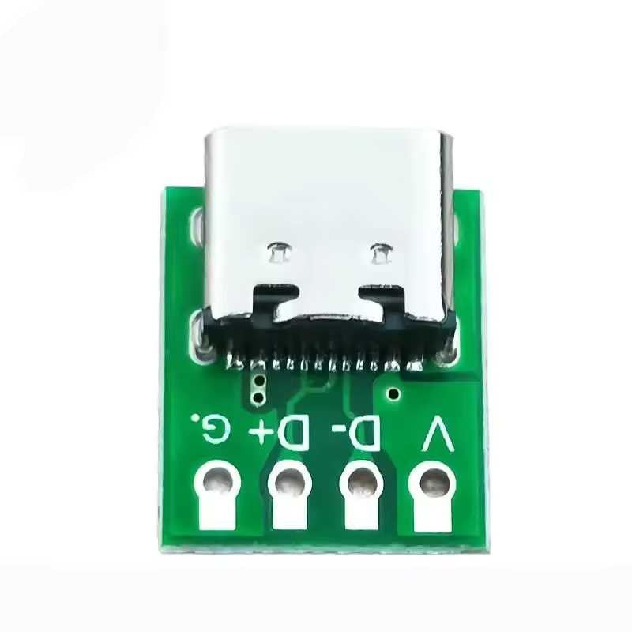
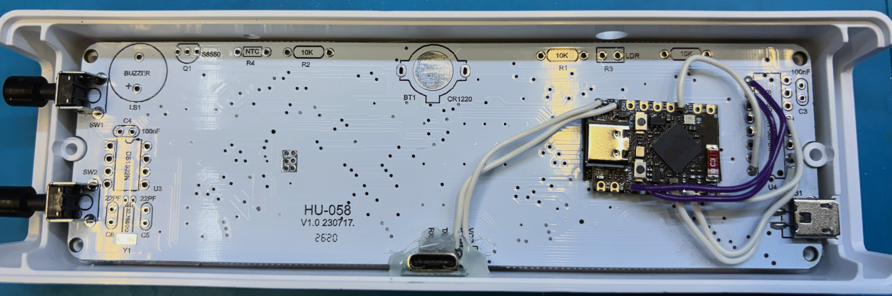
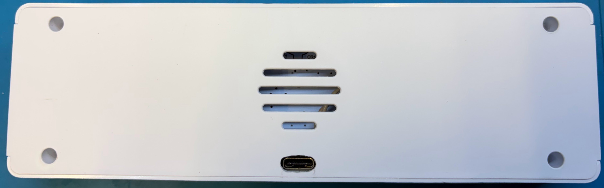

# Open firmware for the HU-058 WiFi clock using the ESP32-S3 Super Mini

Wiring
| ESP32-S3 | Socket pin | Net |
| --- | --- | --- |
| GPIO10 | 14 on HU-058D; 16 on HU-058 / HU-058SE | CLK, driver 1 |
| GPIO7 | 5 | DATA, driver 1 |
| GPIO4 | 1 | CLK_1, driver 2 |
| GPIO5 | 2 | DATA_1, driver 2 |
| GPIO1 | 9 | S1, top button |
| GPIO2 | 10 | S2, bottom button |

## Install via HAOS 

When running HAOS inside Proxmox or another virtual machine, accessing files directly can be challenging. To resolve this, install the "Samba share" add-on by navigating to Settings / Apps within HAOS. Then access the folder "\\YOUR_HAOS_IP\config\esphome\” a file explorer.
Ensure that you copy all required files into that folder, including the “components” folder.

#  HU-058 USB-C Mod
I strongly dislike Micro USB and prefer upgrading to USB-C whenever possible. It makes no sense why the designers chose Micro USB instead of USB-C, especially given that the price difference is negligible... maybe a couple of cents at most.

Upgrading the jack to USB-C appears feasible, though it may demand finer soldering skills than many people feel comfortable with, including myself. To tackle this, I used a USB-C breakout board I had on hand, which fit conveniently between the case and the clocks PCB. I also used 32ga wire to make the connection from the usb board to the VCC and GND. A bit of hot glue holds the USB board securely in place.

 (https://www.aliexpress.us/item/3256808823260777.html)

I used a diamond cutting bit on a Dremel tool to create a hole for the usb connector on the back of the case.

# Open firmware for the HU-058 WiFi clock

The AliExpress kit sold as an "ESP8266 IoT Colorful WiFi Clock Kit" ships closed firmware which is lame and terrible. (And really hard to use.) I have reverse engineered the way to drive the display so you can use your own microcontroller. 

I used an ESP32 running ESPHome so I have full Home Assistant integration and a clock that is far more useful than the $8 original form.

If you only want the reverse engineering, read `docs/`. You can drive this panel from any MCU you like.

## The board variants

Same display and same 8051. The RTC boards also move one display clock wire.

| Board | Sold as | Timekeeping |
| --- | --- | --- |
| HU-058D | [ESP8266 IoT Colorful WiFi Clock Kit](https://www.aliexpress.us/item/3256807371597845.html) | ESP-01S, NTP over WiFi |
| HU-058 / HU-058SE | [DIY KIT Electronic Clock LED Microcontroller Soldering Exercise](https://www.aliexpress.us/item/3256806414008654.html) | Dallas RTC and a coin cell |

**An STC8G1K17 8051 MCU is the brain of both.** It sits in a DIP-16 socket and it
does everything to run the clock: scans the display, reads the buttons, reads a NTC for room temp, a light sensor and drives the buzzer.

Neither the ESP nor the Dallas chip ever touches the panel.

So despite the name, the WiFi one is not an ESP8266 clock. The ESP-01S is a
coprocessor that feeds time it gets from the internet to the 8051 over a serial link,
and its only connection to the rest of the board is one GPIO out and one GPIO
in. A DS1302 is used on the cheap board is for timekeeping, and you manually set it
through the terrible UI on the clock.

Buy whichever is cheaper. You are throwing away the timekeeping part either way.

The display is four seven-segment digits and a colon, built from 33
common-anode RGB LEDs behind two AiP33628 matrix drivers, one per two-wire
bus. The AiP33628 is a Wuxi I-CORE part with a Chinese-only datasheet, no
command set and no grayscale engine. It is a 30-bit shift register in front of
an output latch, so the scan, the brightness and the color mixing are all up to the driving MCU.

The LED display on this clock is multiplexed at around 400hz, so there may be some visible flicker. If you are sensitive to this, you should look elsewhere. It is possible firmware changes could drive the multiplex faster, reducing the flicker. I find the current multiplex rate totally accepetable so I haven't bothered to explore more.

## The conversion

Do not install the socket for the MCU, you will be connecting the new MCU to those pins. Do not install the Dallas or ESP device. Leave off the NTC and light sensor. Don't bother with the buzzer and driver transistor unless you want to use those. They are not used in my firmware. 

The buttons are connected to the ESP32-WROOM-32 in the ESPHome firmware, and are exposed as entities in Home Assistant. If your ESP32 board doesn't expose the GPIO lines listed below, you will need to change the firmware to match the hardware you have. The WROOM-32 board fits perfectly inside the existing clock case once your remote the pin headers.

| ESP32 | Socket pin | Net |
| --- | --- | --- |
| GPIO22 | 14 on HU-058D; 16 on HU-058 / HU-058SE | CLK, driver 1 |
| GPIO21 | 5 | DATA, driver 1 |
| GPIO19 | 1 | CLK_1, driver 2 |
| GPIO18 | 2 | DATA_1, driver 2 |
| GPIO32 | 9 | S1, top button |
| GPIO33 | 10 | S2, bottom button |
| GND | 8 | GND |

The drivers run from the 5V rail but work perfectly with the 3.3V drive signals from the ESP32.

Step-by-step build notes are in `docs/wiring.md`.

## Documentation

| Path | What |
| --- | --- |
| `docs/wiring.md` | Board prep, socket wiring, power, case fit |
| `docs/hardware.md` | What is on the board, pinouts and variants |
| `docs/aip33628-protocol.md` | Frame format, latching, current levels |
| `docs/display-map.md` | COM and SEG to segment, scan, brightness, color |
| `docs/led-layout.md` | Physical coordinates for all 33 LED positions |
| `docs/home-assistant.md` | Every entity and action the firmware exposes |
| `reference/` | The AiP33628 datasheet |

The display map came out of logic analyzer captures of the stock firmware. 

## Firmware

`firmware/esphome/` is the firmware that runs the clock. An ESPHome external
component for the two drivers, plus a config that puts the panel in Home
Assistant:

- One RGB "light" entity for the whole display. Color sets the per channel duty,
  brightness sets the driver current.
- Effects: Per digit and per LED color, gradients at any angle, a color cycle and a
  flash effect.
- Switches for 12h/24h time and colon blink, the two front panel buttons as
  plain inputs, and actions to push a number/characters or the seconds onto the display
  for a few seconds. A unit of C or F lights the degree mark with the number.
- A lamp test button that lights every populated LED white for three seconds,
  then returns to the time with the previous settings.

`firmware/esp32/panel-test/` is a bare-metal PlatformIO project that drives
the same panel with nothing but the Arduino core. It is the better starting
point for a port, and its serial commands are the fastest way to find out
which LED positions a given board actually has fitted.

The firmware polls from the ESPHome NTP default servers every 15 minutes: 0.pool.ntp.org, 1.pool.ntp.org, 2.pool.ntp.org. The timezone comes from Home Assitant. 

## Warnings

The ESPHome firmware does not have any current limits. Driving the entire display at 100% (especially with all colors lit, like white) is not recommended for extended periods. I drive the clock around 45-50% and it seems to be very bright and runs cool. 

You are responsible for any damage you cause to your clock by modifying or using it. Be sensible about how you use it!

## Driving the panel from something else

Nothing about the panel needs an ESP32 or ESPHome. What you need is in three
documents:

1. `docs/aip33628-protocol.md` gives you the 30-bit frame and, more
   importantly, the latch rules. There is no strobe pin. The latch fires on a
   data edge while the clock line is high, which is a trap worth reading twice.
2. `docs/display-map.md` maps COM and SEG values to segments, and gives the
   scan rate and current levels.
3. `docs/led-layout.md` gives the physical coordinate of every LED, which is
   what a gradient or a wipe needs and the logical map does not carry.

The bit-banging is trivial. The two things that will cost you time are the
latch behavior and the fact that the current field is bit reversed against the
rest of the frame. Both are written up.

## Color resolution

The AiP33628 has no grayscale engine, so every duty cycle level costs a sub-frame.
The ESPHome component splits each COM slot into four binary weighted
sub-frames of 40, 80, 160 and 320us, which gives us 16 levels per channel and
4096 colors. Adjacent sub-frames carrying identical data merge before the
schedule reaches the scan interrupt, so a saturated color still costs one
frame per COM pair.

## Status

With the ESP32 firmware, the clock shows NTP time. All configuration is done with Home Assistant which owns color and brightness along with effects and settings like 12/24hz time, etc. 

Firmware updates go over the air, part of the ESPHome suite.

Out of scope by choice: the buzzer, the light sensor and the NTC thermistor. The
buttons are exposed to Home Assistant but carry no built-in behavior.

## AI Disclaimer

This project was coded with assistance from LLMs. Concept, design, testing, QA and code review was all done by me.

## License

Public domain, see `LICENSE`. The exception is code derived from ESPHome,
which stays under its own GPLv3.
